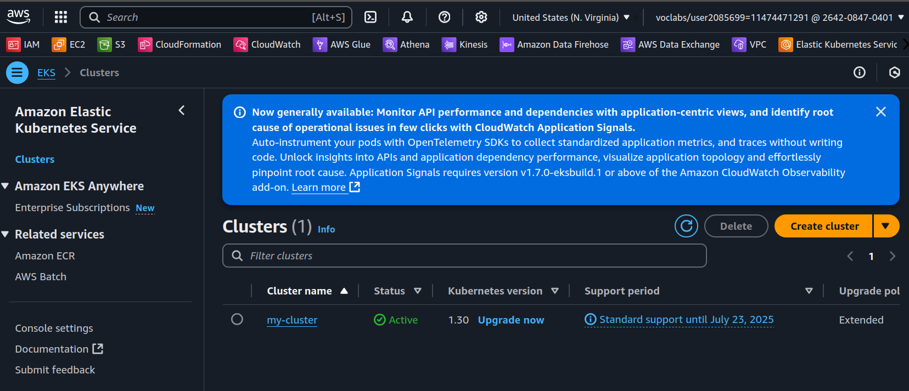
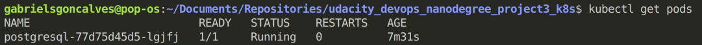
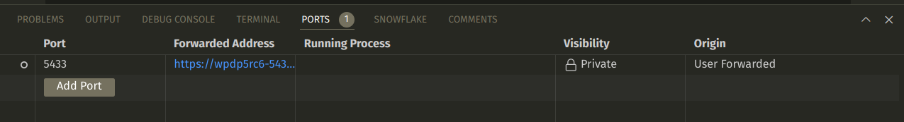
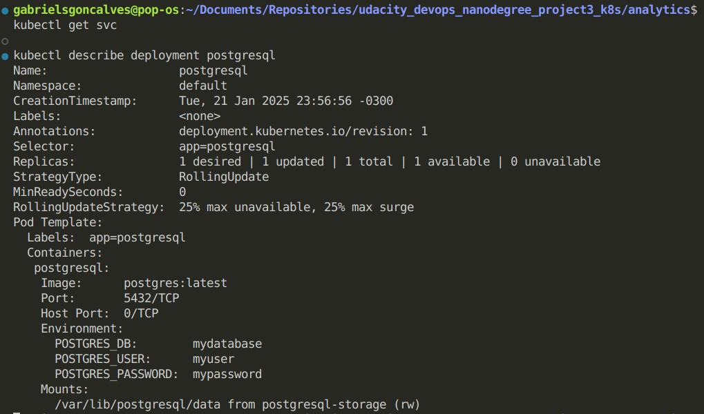
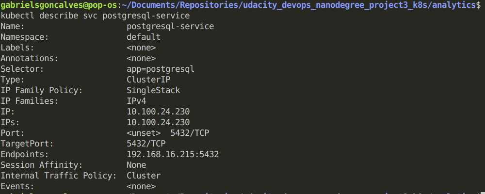
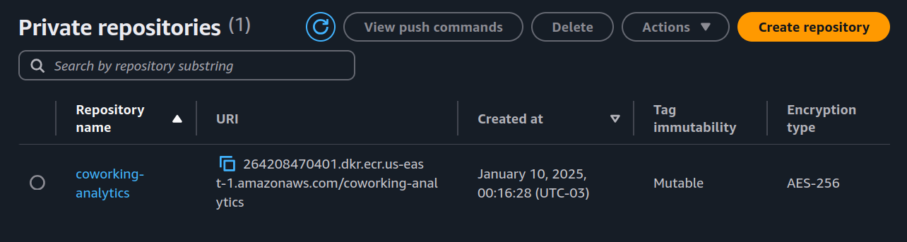
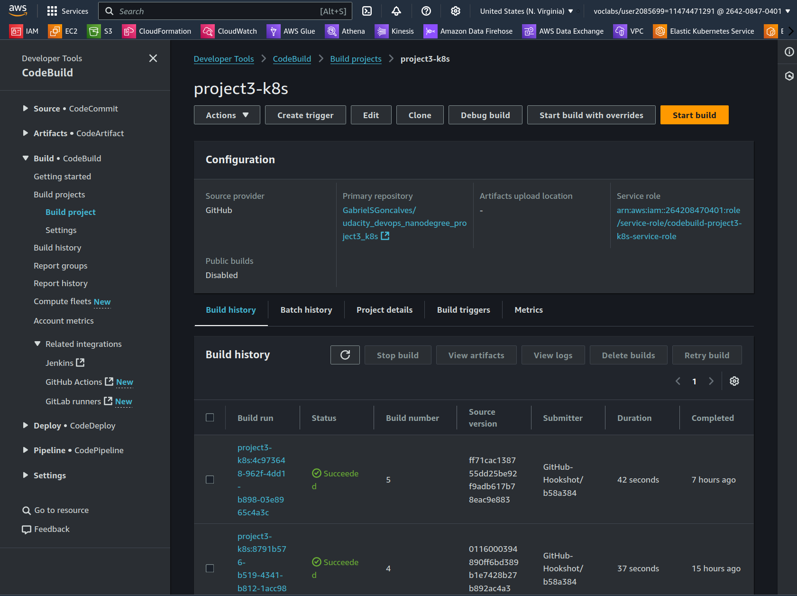
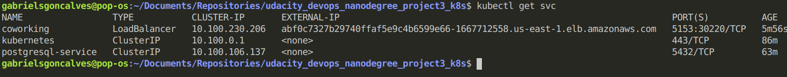
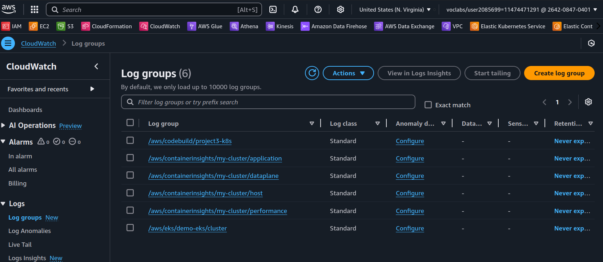
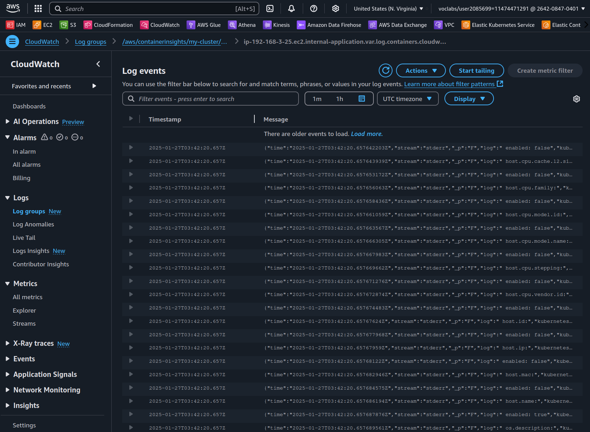

# Project 3: Operationalizing a Microservice with Kubernetes
## Overview
In this project we'll be exploring Kubernetes as a framework for deploying an application for a partner team.

## Project Scenario
The project official description is the following:
```
## Project: Coworking Space Service

The Coworking Space Service is a set of APIs that enables users to request one-time tokens and administrators to authorize access to a coworking space.

This service follows a microservice pattern and the APIs are split into distinct services that can be deployed and managed independently of one another.

For this project, you are a DevOps engineer who will be collaborating with a team that is building an API for business analysts. The API provides business analysts with basic analytics data on user activity in the coworking space service. The application they provide you functions as expected, and you will help build a pipeline to deploy it to Kubernetes.
```

## Objectives
Based on the description, we have the following project objectives:
1. Create an EKS clusters
2. Deploy Postgres database and dockerized application
3. Create Codecommit integration

## Project Instructions

1. Set up a Postgres database.
2. Create a Dockerfile for the Python application.
    a. You'll submit the Dockerfile
3. Write a simple build pipeline with AWS CodeBuild to build and push a Docker image into AWS ECR.
    - Take a screenshot of AWS CodeBuild pipeline for your project submission.
    - Take a screenshot of AWS ECR repository for the application's repository.
4. Create a service and deployment using Kubernetes configuration files to deploy the application.
5. You'll submit all the Kubernetes config files used for deployment (ie YAML files).
    - Take a screenshot of running the kubectl get svc command.
    - Take a screenshot of kubectl get pods.
    - Take a screenshot of kubectl describe svc <DATABASE_SERVICE_NAME>.
    - Take a screenshot of kubectl describe deployment <SERVICE_NAME>.
6. Check AWS CloudWatch for application logs.
    - Take a screenshot of AWS CloudWatch Container Insights logs for the application.
7. Create a README.md file in your solution that serves as documentation for your user to detail how your deployment process works and how the user can deploy changes. The details should not simply rehash what you have done on a step by step basis. Instead, it should help an experienced software developer understand the technologies and tools in the build and deploy process as well as provide them insight into how they would release new builds.

## Installing tools and packages
### Installing Docker
To install Docker in your machine, make sure to follow the [official documentation](https://docs.docker.com/engine/install/).

### Installing Kubectl
Next, we also need to install kubectl to interact with our Kubernetes cluster.
```bash
curl -LO "https://dl.k8s.io/release/$(curl -L -s https://dl.k8s.io/release/stable.txt)/bin/linux/amd64/kubectl"
curl -LO "https://dl.k8s.io/release/$(curl -L -s https://dl.k8s.io/release/stable.txt)/bin/linux/amd64/kubectl.sha256"
echo "$(cat kubectl.sha256)  kubectl" | sha256sum --check
sudo install -o root -g root -m 0755 kubectl /usr/local/bin/kubectl
```
### Installing AWS CLI
AWS CLI is an essential command line tool to interact with AWS and can be installed following [AWS official page](https://docs.aws.amazon.com/cli/latest/userguide/getting-started-install.html).
After installing, make sure to configure AWS CLI with your AWS Access Key ID and AWS Secret Access Key.

### Installing eksctl
eksctl is a tool that makes creating and managing EKS cluster on AWS a breeze.
To install simply execute (in Linux):
```bash
ARCH=amd64
PLATFORM=$(uname -s)_$ARCH
curl -sLO "https://github.com/eksctl-io/eksctl/releases/latest/download/eksctl_$PLATFORM.tar.gz"
curl -sL "https://github.com/eksctl-io/eksctl/releases/latest/download/eksctl_checksums.txt" | grep $PLATFORM | sha256sum --check
tar -xzf eksctl_$PLATFORM.tar.gz -C /tmp && rm eksctl_$PLATFORM.tar.gz
sudo mv /tmp/eksctl /usr/local/bin
```
## Creating resources
With the above tools installed and configured, we can start creating the project resources.

### Creating and configuring EKS cluster
First thing we are going to create is a EKS Cluster.
```bash
eksctl create cluster --name my-cluster --region us-east-1 --nodegroup-name my-nodes --node-type t3.small --nodes 1 --nodes-min 1 --nodes-max 2
```


After a few minutes, with the cluster created you may configure the context for using kubectl
```bash
aws eks --region us-east-1 update-kubeconfig --name my-cluster
```
And also check the context:
```bash
kubectl config current-context
```

### Configure a database for the service
First create the files PersistentVolumeClaim and PersistentVolume YAML files, `pvc.yaml` and `pv.yaml` respectively.
```yaml
# pvc.yaml
apiVersion: v1
kind: PersistentVolumeClaim
metadata:
  name: postgresql-pvc
spec:
  storageClassName: gp2
  accessModes:
    - ReadWriteOnce
  resources:
    requests:
      storage: 1Gi
```
```yaml
# pv.yaml
apiVersion: v1
kind: PersistentVolume
metadata:
  name: my-manual-pv
spec:
  capacity:
    storage: 1Gi
  accessModes:
    - ReadWriteOnce
  persistentVolumeReclaimPolicy: Retain
  storageClassName: gp2
  hostPath:
    path: "/mnt/data"
```

Next check for storage class:
```bash
kubectl get storageclass
```

The output should be something like:
```
NAME   PROVISIONER             RECLAIMPOLICY   VOLUMEBINDINGMODE      ALLOWVOLUMEEXPANSION   AGE
gp2    kubernetes.io/aws-ebs   Delete          WaitForFirstConsumer   false                  10m
```
 And create a `postgres-deployment.yaml` file:
 ```yaml
apiVersion: apps/v1
kind: Deployment
metadata:
  name: postgresql
spec:
  selector:
    matchLabels:
      app: postgresql
  template:
    metadata:
      labels:
        app: postgresql
    spec:
      containers:
      - name: postgresql
        image: postgres:latest
        env:
        - name: POSTGRES_DB
          value: mydatabase
        - name: POSTGRES_USER
          value: myuser
        - name: POSTGRES_PASSWORD
          value: mypassword
        ports:
        - containerPort: 5432
        volumeMounts:
        - mountPath: /var/lib/postgresql/data
          name: postgresql-storage
      volumes:
      - name: postgresql-storage
        persistentVolumeClaim:
          claimName: postgresql-pvc
 ```

And finally, apply YAML configurations to the cluster:
```bash
kubectl apply -f pvc.yaml
kubectl apply -f pv.yaml
kubectl apply -f postgresql-deployment.yaml
```
Check if the pods are running:
```bash
kubectl get pods
```
You should get something like:
```
NAME                          READY   STATUS    RESTARTS   AGE
postgresql-77d75d45d5-lgjfj   1/1     Running   0          84s
```

### Accessing the Postgres database
We can access the Postgres deployed on the EKS cluster through `kubectl` command:
```bash
kubectl exec -it postgresql-77d75d45d5-lgjfj -- bash
```
And `psql` to login to the Postgres database:
```bash
psql -U myuser -d mydatabase
```

### Connecting via Port Fowarding
Create file `postgresql-service.yaml` for exposing the database to user access:
```yaml
apiVersion: v1
kind: Service
metadata:
  name: postgresql-service
spec:
  ports:
  - port: 5432
    targetPort: 5432
  selector:
    app: postgresql
```
And run the `kubectl` command to activate the Port Forward:
```bash
kubectl apply -f postgresql-service.yaml
```
We can check the available services on our EKS cluster:
```bash
kubectl get svc
```


And also the pods:
```bash
kubectl get pods
```


And setup the port-forwarding to the postgresql-service:
```bash
kubectl port-forward service/postgresql-service 5433:5432 &
```


We can also see the details for the Postgres service and deployment:



### Accessing the Postgres database from local machine
After installing locally `postgresql` libs:
```bash
apt install postgresql postgresql-contrib
```

We can try running SQL statements:
```
PGPASSWORD="$DB_PASSWORD" psql --host 127.0.0.1 -U myuser -d mydatabase -p 5433 < db/1_create_tables.sql
PGPASSWORD="$DB_PASSWORD" psql --host 127.0.0.1 -U myuser -d mydatabase -p 5433 < db/2_seed_users.sql
PGPASSWORD="$DB_PASSWORD" psql --host 127.0.0.1 -U myuser -d mydatabase -p 5433 < db/3_seed_tokens.sql
```
Make sure to run each SQL statement in sequence, as there are key dependencies between them.
And finally check the data using SQL queries:
```
PGPASSWORD="$DB_PASSWORD" psql --host 127.0.0.1 -U myuser -d mydatabase -p 5433
```
```
select * from users limit 20;
```

```
id | first_name | last_name |         joined_at          | is_active 
----+------------+-----------+----------------------------+-----------
  1 | Cristopher | Alexander | 2023-01-20 03:23:39.757813 | t
  2 | Dakota     | Gardner   | 2023-02-02 16:23:39.75783  | t
  3 | Mattie     | Moyer     | 2023-01-31 10:23:39.757836 | t
  4 | Darien     | Gamble    | 2023-02-13 05:23:39.75784  | t
  5 | Luca       | Abbott    | 2023-02-11 22:23:39.757844 | t
  6 | Valeria    | Franklin  | 2023-02-07 18:23:39.757848 | t
  7 | Courtney   | Waters    | 2022-12-26 05:23:39.757852 | t
  8 | Aiyana     | Liu       | 2023-01-10 15:23:39.757855 | t
  9 | Weston     | Clark     | 2023-01-18 17:23:39.757859 | t
 10 | Karla      | Oneal     | 2023-01-16 04:23:39.757862 | t
 11 | Dawson     | Taylor    | 2023-01-02 03:23:39.757866 | t
 12 | Aniyah     | Marquez   | 2023-02-05 17:23:39.757869 | t
 13 | Tanya      | Martin    | 2023-01-29 18:23:39.757873 | t
 14 | Gilberto   | Spears    | 2022-12-16 01:23:39.757876 | t
 15 | Saniyah    | Jimenez   | 2023-01-24 16:23:39.75788  | t
 16 | Warren     | Griffith  | 2023-02-12 23:23:39.757883 | t
 17 | Kellen     | Harrison  | 2023-01-02 11:23:39.757886 | t
 18 | Carolina   | Schwartz  | 2023-01-15 06:23:39.75789  | t
 19 | Camille    | Curry     | 2022-12-20 12:23:39.757893 | t
 20 | Erik       | Ramirez   | 2023-02-12 05:23:39.757897 | t
```

## Building the analytics application locally
Before we run the application locally, we need to install the dependencies:
```bash
sudo apt update
sudo apt install build-essential libpq-dev
pip install --upgrade pip setuptools wheel
pip install -r requirements.txt
```

Next, we create a `.env` for storing the local variables:
```
# .env
DB_USERNAME=myuser
DB_PASSWORD=${POSTGRES_PASSWORD}
DB_HOST=127.0.0.1
DB_PORT=5433
DB_NAME=mydatabase
```
And export it using:
```bash
export $(grep -v '^#' .env | xargs)
```
We need to setup the forward port for connecting to the Postgres service before executing the application.
```bash
kubectl port-forward --namespace default svc/postgresql-service 5433:5432 &
```
```bash
export POSTGRES_PASSWORD=$(kubectl get secret --namespace default svc/postgresql-service -o jsonpath="{.data.postgres-password}" | base64 -d)
```

Now we can run the application.
```bash
python3 app.py
```

Verifying the application.
```bash
curl 127.0.0.1:5153/api/reports/daily_usage
```
```
{"2023-02-07":21,"2023-02-08":111,"2023-02-09":96,"2023-02-10":87,"2023-02-11":88,"2023-02-12":105,"2023-02-13":103,"2023-02-14":65}
```
```bash
curl 127.0.0.1:5153/api/reports/user_visits

```
```
{"1":{"joined_at":"2023-01-20 03:23:39.757813","visits":3},"3":{"joined_at":"2023-01-31 10:23:39.757836","visits":4},"5":{"joined_at":"2023-02-11 22:23:39.757844","visits":2},"6":{"joined_at":"2023-02-07 18:23:39.757848","visits":1},"7":{"joined_at":"2022-12-26 05:23:39.757852","visits":3},"8":{"joined_at":"2023-01-10 15:23:39.757855","visits":4},"9":{"joined_at":"2023-01-18 17:23:39.757859","visits":1},"10":{"joined_at":"2023-01-16 04:23:39.757862","visits":3},"11":{"joined_at":"2023-01-02 03:23:39.757866","visits":3},"12":{"joined_at":"2023-02-05 17:23:39.757869","visits":3},"13":{"joined_at":"2023-01-29 18:23:39.757873","visits":4},"14":{"joined_at":"2022-12-16 01:23:39.757876","visits":3},"16":{"joined_at":"2023-02-12 23:23:39.757883","visits":5},"17":
...
```

## Dockerizing the application
Next, we need to dockerize our tested application.
First, we need to create our Dockerfile.
```
FROM python:3.10-slim-buster

WORKDIR /src

COPY ./app/requirements.txt requirements.txt

RUN pip install -r requirements.txt

COPY ./app .

CMD python app.py
```
To create a Docker image with our application, we simply run:
```bash
cd analytics
docker build -t analytics-test-docker .
```

You can check if the image was created using:
```bash
docker images
```
And create a Docker container from the created image:
```bash
docker run --network="host" --env-file .env analytics-test-docker
```

## Setting up CI with AWS CodeBuild
Moving on, we need to create a Continuous Integration pipeline for deploying our application based on Git repository changes. 

### ECR repository creation
We'll first create an AWS ECR repository to host our Docker images:
```bash
aws ecr create-repository \
    --repository-name coworking-analytics \
    --image-scanning-configuration scanOnPush=true
```


### CodeBuild project creation
The next step consists of creating a new CodeBuild project that is going to be linked to this current Github project repository. We have used default configurations recommended by the course video on CodeBuild, and also added the following variables:
```
AWS_DEFAULT_REGION='us-east-1'
AWS_ACCOUNT_ID='<AWS-account-id>
APP_IMAGE_REPO_NAME='coworking-analytics'
```
We executed the "Start build" to make sure the variables were correctly set.



## Deploying the application
Finally, we need to create the deployment YAML files with the secrets to connect to the deployed database.
The files can be found in the `deployment` folder.

```
# configmap.yaml
apiVersion: v1

kind: ConfigMap
metadata:
  name: coworking-config
data:
  DB_NAME: "mydatabase"
  DB_USER: "myuser"
  DB_HOST: "postgresql-service"
  DB_PORT: "5432"
```
```secrets.yaml
apiVersion: v1
kind: Secret
metadata:
  name: dbpassword-secret
type: Opaque
data:
  DB_PASSWORD: <db-password-in-base64>
```
```
# coworking-deployment.yaml
apiVersion: v1
kind: Service
metadata:
  name: coworking
spec:
  type: LoadBalancer
  selector:
    service: coworking
  ports:
  - name: "5153"
    protocol: TCP
    port: 5153
    targetPort: 5153
---
apiVersion: apps/v1
kind: Deployment
metadata:
  name: coworking
  labels:
    name: coworking
spec:
  replicas: 1
  selector:
    matchLabels:
      service: coworking
  template:
    metadata:
      labels:
        service: coworking
    spec:
      containers:
      - name: coworking-analytics
        image: 264208470401.dkr.ecr.us-east-1.amazonaws.com/coworking-analytics:4
        imagePullPolicy: IfNotPresent
        livenessProbe:
          httpGet:
            path: /health_check
            port: 5153
          initialDelaySeconds: 5
          timeoutSeconds: 2
        readinessProbe:
          httpGet:
            path: "/readiness_check"
            port: 5153
          initialDelaySeconds: 5
          timeoutSeconds: 5
        envFrom:
        - configMapRef:
            name: coworking-config
        env:
        - name: DB_PASSWORD
          valueFrom:
            secretKeyRef:
              name: dbpassword-secret
              key: DB_PASSWORD
      restartPolicy: Always
```
To deploy it, we need to execute the following command:
```bash
kubectl apply -f deployment/coworking-deployment.yaml
```
The deployed application can be verified with:


And also, the logs in CloudWatch, but first we need to install the Cloud Watch Agent on the EKS cluster to get the Container Insights logs:

```bash
aws iam attach-role-policy \
--role-name eksctl-my-cluster-nodegroup-my-nod-NodeInstanceRole-Nc68pgkOnkky \
--policy-arn arn:aws:iam::aws:policy/CloudWatchAgentServerPolicy 
```
```bash
aws eks create-addon --addon-name amazon-cloudwatch-observability --cluster-name my-cluster
```
You should get an output in the terminal similar to this:
```bash
{
    "addon": {
        "addonName": "amazon-cloudwatch-observability",
        "clusterName": "my-cluster",
        "status": "CREATING",
        "addonVersion": "v3.1.0-eksbuild.1",
        "health": {
            "issues": []
        },
        "addonArn": "arn:aws:eks:us-east-1:264208470401:addon/my-cluster/amazon-cloudwatch-observability/baca52ec-e597-accd-b6e0-d6fb2ef68ee4",
        "createdAt": "2025-01-27T00:41:41.668000-03:00",
        "modifiedAt": "2025-01-27T00:41:41.684000-03:00",
        "tags": {}
    }
}
```
Go back to the CloudWatch log groups and you'll find a list of new streams:




## Resources clean up
To close the forwarded ports for the Kubernetes cluster:
```bash
ps aux | grep 'kubectl port-forward' | grep -v grep | awk '{print $2}' | xargs -r kill
```

### Deleting the EKS cluster
And finally, to avoid unecessary cloud cost, make sure to delete the EKS cluster as soon you finish the project.
```bash
eksctl delete cluster --name my-cluster --region us-east-1
```


## References
- [Install Docker Engine](https://docs.docker.com/engine/install/)
[Minikube start](https://minikube.sigs.k8s.io/docs/start/?arch=%2Flinux%2Fx86-64%2Fstable%2Fbinary+download)
